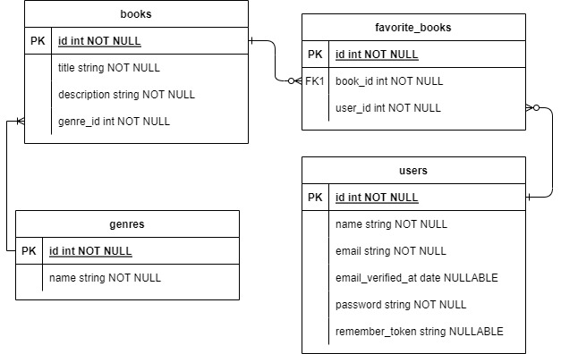

# Trezlabs test Rony Garcia

Library

## Pre-requisites
- Php 8.2
- PostgreSQL 15
- Composer

## Installation
1. Create a copy of `.env.example` with name `.env`
in the root of the project, and set your credentials.

```bash
cp .env.example .env
```

### Enviroment variables
| Variables| Description|  
| ----------- | -----------|
|APP_NAME                             |The system name tha will display.
|APP_ENV 	                                 |System enviroment.
|APP_KEY                                    |Application key encoded.
|APP_DEBUG                                 |Flag to activate stack when an error occurs.
|APP_URL                              |System url.
|BD_CONNECTION                               |Database dialect.
|DB_HOST                     |Database host. 
|DB_PORT                 |Port where DB is running.
|FORWARD_DB_PORT                 |Port where docker container will be deployed.
|DB_DATABASE                               |Database name. 
|DB_USERNAME                               |Database username.
|DB_PASSWORD                               |Database password.
|L5_SWAGGER_CONST_HOST                               |Server URL for API Swagger Documentation.

Use composer to install dependencies.

```bash
composer install
```
## Commands
Run project: 
```bash
php artisan serve
``` 
Compile documentation:
```bash
php artisan l5-swagger:generate
``` 
## Database schema


## Database commands
Run migrations
```bash
php artisan migrate
``` 
## Deploy heroku
https://trezlabs.herokuapp.com/

## Documentation
https://trezlabs.herokuapp.com/api/documentation